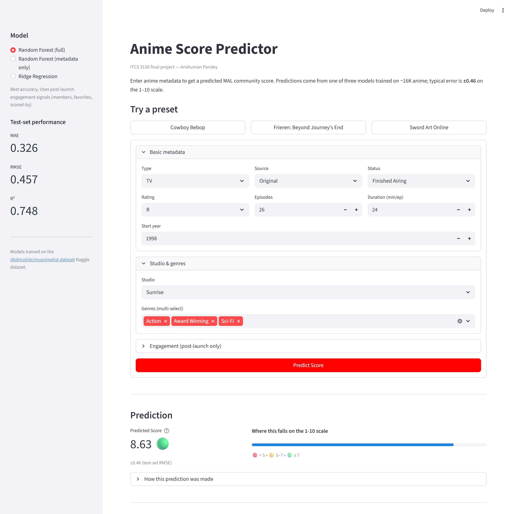

# Anime Score Prediction

ITCS 3156 (Intro to Machine Learning) final project, UNC Charlotte, Spring 2026.
Author: Anshuman Pandey.

Repo: https://github.com/ap05-epic/anime-score-prediction

## Summary

Regression on the MyAnimeList community Score (1-10 continuous) given anime metadata. Two course-covered models are compared: **Ridge Regression** (linear baseline) and **Random Forest Regressor** (non-linear ensemble). A Feed-Forward Neural Network (TensorFlow/Keras) is included as an optional third model. The headline question is how much non-linear interactions and engagement-style features contribute to predictability of the score, and how the picture changes when leakage-adjacent features are removed.

## Headline result

**Random Forest achieves R² = 0.748, RMSE = 0.457, MAE = 0.327** on the held-out test set, beating the Ridge baseline (R² = 0.653) and a Feed-Forward Neural Network (R² = 0.742). A leakage ablation that drops the engagement features (log_Members, log_Favorites, log_Scored_By) costs ~0.15 R²; pure-metadata Random Forest still hits R² = 0.595, well above the null baseline of 0.

| Model | MAE | RMSE | R² | Best params |
|---|---|---|---|---|
| Null baseline | 0.7336 | 0.9089 | 0.000 | predict mean(y_train) |
| Ridge | 0.4055 | 0.5356 | 0.6528 | alpha = 10 |
| **Random Forest** | **0.3265** | **0.4567** | **0.7475** | n_estimators=500, max_depth=30, min_samples_leaf=1 |
| Feed-Forward NN | 0.3347 | 0.4614 | 0.7423 | 128-64 dense, dropout 0.3, Adam lr=1e-3 |
| RF (no leakage) | 0.4336 | 0.5782 | 0.5954 | same RF params, engagement features dropped |

## Demo

A Streamlit app at `app.py` lets you enter anime metadata and get a live score prediction. Nine preset buttons (Cowboy Bebop, Frieren, SAO, Death Note, FMAB, K-On!, Boruto, Pupa, Ex-Arm) auto-fill the form so you can demo without typing.



To launch the app, follow the **Getting started** guide below. The launch command itself is one line: `streamlit run app.py`.

## Dataset

- Source: [dbdmobile/myanimelist-dataset on Kaggle](https://www.kaggle.com/datasets/dbdmobile/myanimelist-dataset)
- File used: `anime-dataset-2023.csv` (24,905 rows, 24 columns)
- Filtered to rows with a non-missing Score (~17K usable anime)
- Not committed; see `data/README.md` for download instructions

## Getting started

> **Repo:** <https://github.com/ap05-epic/anime-score-prediction>

Total time: about 10 minutes (most of it waiting for `pip install` and one notebook run). The instructions assume zero prior knowledge of Python virtual environments or Jupyter kernels.

### Prerequisites

- **Python 3.10 or 3.11** — check with `python --version`. TensorFlow 2.13+ does not yet support 3.12 on Windows, so stick to 3.10 or 3.11. Get it from [python.org](https://www.python.org/downloads/) if missing.
- **Git** (or just download the ZIP from [GitHub](https://github.com/ap05-epic/anime-score-prediction)).
- About **1.5 GB free disk space** (the ML libraries and trained models are bulky).

### Step 1 — Get the code

Repo URL: <https://github.com/ap05-epic/anime-score-prediction>

```bash
git clone https://github.com/ap05-epic/anime-score-prediction.git
cd anime-score-prediction
```

**Already cloned and want the latest version?** From inside the project folder:

```bash
git pull
```

(That pulls from <https://github.com/ap05-epic/anime-score-prediction>.)

**No git installed?** Hit the green **Code** button on the [repo page](https://github.com/ap05-epic/anime-score-prediction), choose **Download ZIP**, extract it, and `cd` into the extracted folder in a terminal.

### Step 2 — Create and activate a virtual environment

This keeps the project's Python libraries isolated from anything else on your machine.

```bash
# One-time: create the venv
python -m venv .venv
```

Then **activate** it (you'll do this every time you open a new terminal for this project):

```powershell
# Windows (PowerShell)
.venv\Scripts\Activate.ps1
```
```cmd
:: Windows (Command Prompt)
.venv\Scripts\activate.bat
```
```bash
# macOS / Linux
source .venv/bin/activate
```

After activation, your prompt should be prefixed with `(.venv)`. If PowerShell complains about execution policy, run `Set-ExecutionPolicy -Scope CurrentUser RemoteSigned` once and try again.

### Step 3 — Install the dependencies

With the venv active:

```bash
pip install --upgrade pip
pip install -r requirements.txt
```

This pulls in pandas, scikit-learn, matplotlib, seaborn, jupyter, tensorflow, streamlit, and joblib. Takes 2-5 minutes the first time.

### Step 4 — Download the dataset

The CSV is not in this repo (it's 15 MB and you can fetch it for free):

1. Make a free Kaggle account if you don't have one.
2. Go to <https://www.kaggle.com/datasets/dbdmobile/myanimelist-dataset>.
3. Click **Download** and unzip.
4. Move only `anime-dataset-2023.csv` into the project's `data/` folder, so the path is `data/anime-dataset-2023.csv`.

You don't need the two big user files (`users-details-2023.csv`, `users-score-2023.csv`) — they're not used.

### Step 5 — Register the venv as a Jupyter kernel

This is the step most people get stuck on. Jupyter doesn't automatically know about your venv; you have to tell it. With the venv active:

```bash
python -m ipykernel install --user --name=mlfinals --display-name="Python (mlfinals)"
```

After this, when you open Jupyter, the **Kernel** menu will list `Python (mlfinals)`. That's the one to pick.

### Step 6 — Train the models (run the notebook)

The trained models (~190 MB total) are not committed to the repo because the Random Forest pickle is too big for GitHub's per-file limit. You generate them by running the modeling notebook end-to-end. Takes about **3 minutes** on a normal laptop.

```bash
jupyter lab
```

Jupyter Lab opens in your browser.

1. In the file browser on the left, navigate to `notebooks/` and double-click `02_modeling.ipynb`.
2. **Important**: in the top-right of the notebook, click the kernel name and switch to **Python (mlfinals)**. (If it's not in the list, you skipped Step 5.)
3. Click the menu **Run → Run All Cells**.
4. Wait until the last cell prints something like `wrote 11 artifacts to ...\models`. The `models/` folder now contains the trained models, scaler, and supporting JSON files.

You can also browse `01_eda.ipynb` to see the six EDA plots, but it's optional.

### Step 7 — Launch the Streamlit demo

Back in the terminal (still with the venv active):

```bash
streamlit run app.py
```

Streamlit prints a URL (default `http://localhost:8501`) and usually opens it automatically. If not, paste it into your browser.

In the app:
- Pick a model in the left sidebar.
- Click any preset button (e.g. **Cowboy Bebop · actual 8.75**).
- Hit **Predict Score**.
- Compare the predicted number against the "actual" on the button label.

Press `Ctrl+C` in the terminal to stop the server.

### Troubleshooting

**`ModuleNotFoundError: No module named 'pandas'` (or any other library)**
Your venv isn't active. Re-run the activate command from Step 2 and confirm with `pip list` that the libraries are installed.

**Jupyter shows only "Python 3" — no "Python (mlfinals)"**
You skipped Step 5, or you ran the `ipykernel install` command from outside the venv. Activate the venv, re-run Step 5, then refresh the Jupyter Lab tab.

**`FileNotFoundError: data/anime-dataset-2023.csv`**
You skipped Step 4 or saved the CSV in the wrong folder. The file must live at `data/anime-dataset-2023.csv` exactly.

**Streamlit launches but errors with `FileNotFoundError: models/...`**
You skipped Step 6 or the notebook didn't reach its last cell. Re-run `02_modeling.ipynb` and watch for the `wrote 11 artifacts` message.

**`Kernel died` or notebook import errors**
The notebook is using the wrong Python. Top-right kernel selector → **Python (mlfinals)**.

**`pip install tensorflow` fails on Windows with Python 3.12**
TensorFlow 2.13-2.15 doesn't support Python 3.12 on Windows yet. Either install Python 3.11 alongside (and re-create the venv with `py -3.11 -m venv .venv`), or comment out the FFN section at the bottom of `02_modeling.ipynb` — the assignment only requires two algorithms and the FFN is the optional third.

**PowerShell: `cannot be loaded because running scripts is disabled on this system`**
Run once: `Set-ExecutionPolicy -Scope CurrentUser RemoteSigned`, confirm with `Y`, then re-activate.

**The Streamlit page is blank**
Force-refresh the browser tab (`Ctrl+Shift+R` or `Cmd+Shift+R`). If it's still blank, check the terminal for a Python error.

## Folder map

```
.
├── README.md                  this file
├── PLAN.md                    full strategic plan
├── LICENSE                    MIT
├── requirements.txt
├── app.py                     Streamlit demo UI (run with `streamlit run app.py`)
├── data/                      place anime-dataset-2023.csv here (not committed)
├── notebooks/
│   ├── 01_eda.ipynb           EDA + 6 figures
│   └── 02_modeling.ipynb      preprocessing, Ridge, RF, leakage ablation, optional FFN, persists trained artifacts
├── src/
│   ├── preprocess.py          reusable preprocessing pipeline (used by both notebook and app)
│   └── predict.py             single-row inference helper used by the Streamlit app
├── models/                    trained models + scaler + JSON metadata (gitignored — generated by step 6)
└── figures/                   300 dpi PNGs used in the report and the Streamlit screenshot
```

## Methods

- Preprocessing: replace `"UNKNOWN"` sentinel with NaN, coerce stringified numerics, parse `Aired` to `start_year`, parse `Duration` to minutes, log-transform engagement counts, multi-label binarize genres, top-20 studios + "Other", one-hot encode `Type`/`Source`/`Rating`/`Status`/`Studios` with `drop_first=True`, median-impute remaining numerics, then 70/15/15 train/val/test split with StandardScaler fit on train only.
- Models:
  - **Ridge Regression** with `GridSearchCV` over alpha
  - **Random Forest Regressor** with `RandomizedSearchCV` over n_estimators, max_depth, min_samples_leaf
  - **Leakage ablation**: refit best RF without log_Members, log_Favorites, log_Scored_By
  - **(Optional) Feed-Forward NN**: 128-64 dense with dropout, Adam, MSE, EarlyStopping

## Acknowledgement

This project used Anthropic's Claude (web app for strategic planning and report writeup; Claude Code CLI for code, modeling, plots, and repo management). All code was reviewed and run by the author.

## License

MIT. See [LICENSE](LICENSE) for the full text.

